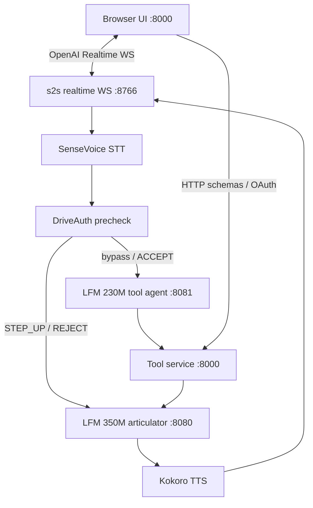
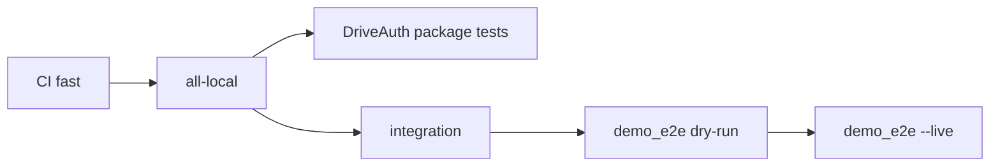

# Nova S2S

[](https://www.python.org/downloads/)
[](https://docs.astral.sh/uv/)
[](.github/workflows/ci.yml)

On-device in-vehicle voice assistant: **cascaded** SenseVoice → llama.cpp GGUF(s) → Kokoro, with a FastAPI tool service and mock-first DriveAuth for payments.

**Default (small GPU):** dual LFM — 230M tool agent (`:8081`) + 350M articulator (`:8080`).  
**Thor / single GGUF:** `NOVA_CONFIG=nova/config.thor.yaml` — one model, full toolbox (`tool_route_mode: full`), no `:8081`.



## Why cascaded (not native audio-in)

The speak model must stay free to stream TTS while tools run. A single native-audio model that holds the mic encoder through the turn cannot meet the TTFB target on this hardware class. Cascaded STT → text LLM → TTS supports both the dual-LFM split and a single stronger GGUF with the full toolbox.

## Adopted stack

| Piece | Source | Role in Nova |
|-------|--------|--------------|
| [speech-to-speech](https://github.com/huggingface/speech-to-speech) | Hugging Face (git submodule `cloned/speech-to-speech`) | Realtime VAD/STT/LLM/TTS loop; Nova patches add route/agent/DriveAuth hooks |
| [DriveAuth Edge](https://github.com/Senthi1Kumar/Drive_auth_edge) | Parth's upstream ([`couder-04/Drive_auth_edge`](https://github.com/couder-04/Drive_auth_edge)); submodule tracks this repo (fork) | **Core** payment Trust/Risk gate; Nova owns only the HTTP adapter |
| llama.cpp `llama-server` | **Build locally** — do not commit the binary | Serves GGUFs on `:8080` (and `:8081` in dual-LFM mode) |

LiteRT / LiteRT-LM wrappers from early experiments are **not** part of this runtime and are excluded from the published tree.

## Quickstart

### 1. Prerequisites

- Python 3.12+ with [`uv`](https://docs.astral.sh/uv/)
- Built **`llama-server`** from [llama.cpp](https://github.com/ggerganov/llama.cpp)
- LFM GGUF files referenced by `nova/launch/models.yaml`
- Chrome/Edge (mic + Web Audio)

### 2. Environment

```bash
cp .env.example .env
# Edit .env: set LLAMA_SERVER_BIN, model paths (via models.yaml), optional API keys
```

Build llama.cpp (example):

```bash
git clone https://github.com/ggerganov/llama.cpp.git
cmake -S llama.cpp -B llama.cpp/build -DGGML_CUDA=ON   # or CPU-only
cmake --build llama.cpp/build -j
# then in .env:
# LLAMA_SERVER_BIN=/absolute/path/to/llama.cpp/build/bin/llama-server
```

### 3. Install and run

```bash
git submodule update --init --recursive
uv sync
uv run python scripts/run_demo.py
```

Open **http://127.0.0.1:8000/** → **Call**. `Ctrl-C` stops the stack.

`scripts/run_demo.py` is the **launcher** (not a test). It starts llama-server(s), the tool service, and s2s, then waits.

## Tests (map)

| Layer | Command | Models / GPU? | What it covers |
|-------|---------|---------------|----------------|
| **CI (GitHub Actions)** | `.github/workflows/ci.yml` | No | `fast` + DriveAuth mock unit tests only |
| **Fast** | `bash scripts/run_tests.sh fast` | No | Deterministic Nova contracts |
| **All local** | `bash scripts/run_tests.sh all-local` | No | Component + s2s regressions + eval + integration |
| **DriveAuth package** | `uv run pytest -q Drive_auth_edge/tests` | No | Standalone Trust/Risk suite (Parth’s package) |
| **Integration** | `uv run pytest -q tests/integration` | No | Replay + fake dual-LLM |
| **E2E dry-run** | `uv run python scripts/demo_e2e.py` | No | DriveAuth journeys + report JSON |
| **E2E live** | stack up, then `uv run python scripts/demo_e2e.py --live` | Yes | WS / audio / TTFB (operator-run) |

Details: [docs/testing.md](docs/testing.md).



## Configuration

| File | Purpose |
|------|---------|
| `nova/config.yaml` | STT/TTS devices, WS ports, `tool_route_mode`, DriveAuth demo flags |
| `nova/launch/models.yaml` | GGUF profiles (`gguf_path`, ctx, GPU layers, ports) |
| `.env` | `LLAMA_SERVER_BIN`, Google OAuth, Tavily/Brave, `DRIVEAUTH_*` |
| `prompts/soul.md` | Articulator system persona |

## Docs

| Doc | Contents |
|-----|----------|
| [docs/setup.md](docs/setup.md) | Install, llama.cpp, env, first run |
| [docs/google_workspace.md](docs/google_workspace.md) | GCP OAuth, API enablement, Workspace MCP (Calendar/Gmail/Drive) |
| [docs/pipeline.md](docs/pipeline.md) | Dual-LFM vs full turn paths, DriveAuth gates |
| [docs/testing.md](docs/testing.md) | Test ladder, CI vs local, release gates |
| [docs/milestones.md](docs/milestones.md) | M0–M6 status for this lineage |
| [docs/THIRD_PARTY.md](docs/THIRD_PARTY.md) | speech-to-speech + llama.cpp (external runtimes) |

## Credits

- **DriveAuth Edge** — authored by **Parth** ([couder-04](https://github.com/couder-04/Drive_auth_edge)); this repository vendors the [`Senthi1Kumar/Drive_auth_edge`](https://github.com/Senthi1Kumar/Drive_auth_edge) fork as submodule `Drive_auth_edge` and wires it into the payment path. Nova does not reimplement Trust/Risk/policy.
- **speech-to-speech** — [Hugging Face](https://github.com/huggingface/speech-to-speech), adapted for Nova hooks.
- **llama.cpp** — build `llama-server` locally.

## Single model (Thor / Jetson — full toolbox)

Dual LFM is for small-GPU boxes. On Thor-class hardware run **one** GGUF with the entire toolbox:

```bash
# Ensure models.yaml gguf_path exists on the board, then:
NOVA_CONFIG=nova/config.thor.yaml uv run python scripts/run_demo.py
```

That sets `tool_route_mode: full` (all tools, `tool_choice=auto`), skips `:8081`, and keeps cascaded STT → LLM → TTS plus DriveAuth. Prefer `full` over `force` for this experiment. Speak each tool’s `speak` field verbatim; confirmation gates still apply. Details: [docs/setup.md](docs/setup.md#thor-single-model-full-toolbox), [docs/pipeline.md](docs/pipeline.md).

## License

See dependency and model licenses. DriveAuth Edge terms follow its upstream repository.
