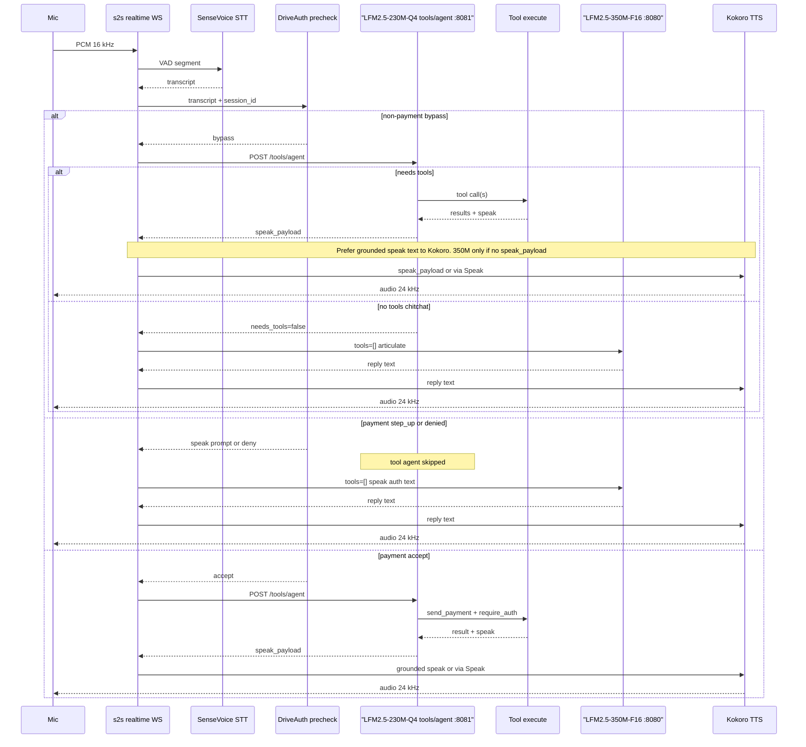
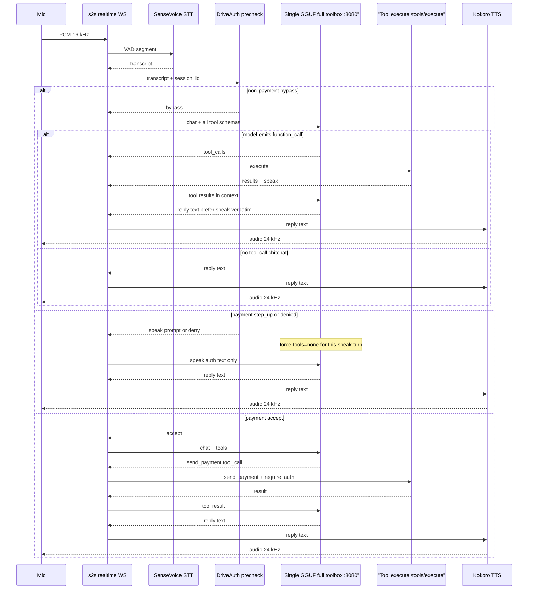

# Pipeline

## Modes

| `tool_route_mode` | Servers | Who sees tools |
|-------------------|---------|----------------|
| **`full`** (Thor / single GGUF) | `:8080` only | One model, all schemas, `tool_choice=auto` |
| **`model`** (small GPU) | `:8080` speak + `:8081` agent | LFM2.5-230M-Q4 picks/executes; LFM2.5-350M-F16 speaks with `tools=[]` |
| **`force`** | `:8080` | Lexical named `tool_choice` (legacy; avoid for full-toolbox tests) |

Every turn still runs SenseVoice → DriveAuth **precheck** → (tools if any) → speak → Kokoro. DriveAuth only *gates* payment utterances; ordinary turns get `bypass`.

---

## Turn path — `model` mode (dual LFM)

**Ordinary (non-payment):** precheck bypasses. If the agent needs tools → `POST /tools/agent` (LFM2.5-230M-Q4 on `:8081`) executes them and returns `speak_payload`. That text is spoken via Kokoro (verbatim when `speak` is present; otherwise LFM2.5-350M-F16 articulates with `tools=[]`, then Kokoro). If the agent needs no tools → LFM2.5-350M-F16 → Kokoro only.

**Payment:** precheck may `step_up_required` / `denied` (speak prompt or deny, **no** tool agent) or `accept` (continue into the agent so `send_payment` can run `require_auth`).

| Model | Port | Job |
|-------|------|-----|
| LFM2.5-230M-Q4 | `:8081` | Tool pick + execute (`/tools/agent`) |
| LFM2.5-350M-F16 | `:8080` | Articulate when there is no ready `speak_payload` (`tools=[]`) |
| Kokoro | (s2s) | TTS only — not an LLM |

---

## Turn path — `full` mode (single GGUF)

Same Auth split. One model on `:8080` both calls tools (`tool_choice=auto`) and produces the reply text; Kokoro only synthesizes audio. No `:8081`.

Point `llm_profile` at the board GGUF (e.g. Gemma-4-E2B-it Q4 in `nova/config.thor.yaml`). Prefill grows with the full toolbox.

---

## DriveAuth (two gates)

Core payment path (submodule `Drive_auth_edge`, authored by Parth / `couder-04`; this repo vendors the `Senthi1Kumar/Drive_auth_edge` fork). Nova owns only the adapter: `nova/server/driveauth_bridge.py`, `nova/tools/payment.py`, `POST /tools/auth/precheck`.

1. **Precheck** (`authenticate`) after final transcript — payment intents only; otherwise bypass.
2. **Tool boundary** (`require_auth`) on `send_payment` — may reuse a fresh same-session ACCEPT.

Mock mode may synthesize audio inside the adapter; production fails closed without real sensors.

---

## Metrics

Live percentiles: `GET /api/metrics/s2s/percentiles` on the tool service. Graph with `scripts/s2s_latency_graph.py`.

## Thor single-model smoke

See [setup.md](setup.md#thor-single-model-full-toolbox). Use `nova/config.thor.yaml` via `NOVA_CONFIG`.
