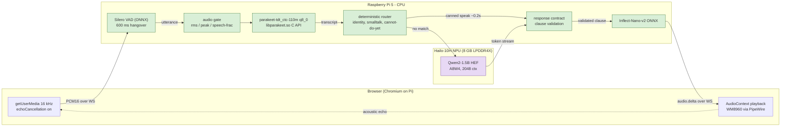

# Nova-Hailo — RPi5 + Hailo-10H voice cascade

On-device voice stack for in-cabin / POC demos. ASR and TTS run on the Pi
CPU; the Hailo-10H NPU is dedicated to the LLM, which is the bandwidth-bound
stage.



The dotted edge is the open problem: the speaker feeds the mic, so barge-in and
echo trade against each other until pVAD or hardware AEC lands — see
[Turn-taking and echo](#turn-taking-and-echo).

| Field | Value |
| --- | --- |
| Host path (dev) | `edge/nova-hailo` in this repo |
| Host path (Pi) | `~/nsk/nova-hailo` |
| HailoRT | **5.1.1 only** (do not upgrade before the OEM demo) |
| v0.0.1 scope | conversation only — no tools / MCP |
| PoC backlog | [`TODO.md`](TODO.md) |

## Components

| Stage | Backend | Device | Measured (real-mic corpus) |
| --- | --- | --- | --- |
| VAD | Silero ONNX | CPU | detect p50 ~30 ms |
| ASR | **parakeet-tdt_ctc-110m** q8_0 via parakeet.cpp C API | **CPU** | infer p50 **292 ms**; WER **0.167** near / **0.20** far |
| Router | deterministic regex to canned `speak` | CPU | ~0.2 s TTFA |
| LLM | Qwen2-1.5B HEF (A8W4, 2048 ctx) | **Hailo-10H** | native-context TTFT **316 ms**, ~8.3 tok/s |
| TTS | **Inflect-Nano-v2** ONNX | CPU | RTF **0.18** (351 ms synth / 1.95 s audio), init 0.72 s |

ASR moved off the NPU on measured evidence. Whisper-Base — the only ASR in the
5.1.1 catalog — scored WER **0.333 near / 0.60 far** at 344 ms and could not
transcribe the wake word "Nova" (it produced "No"). parakeet-tdt_ctc-110m halves
near-field error, thirds it at distance, runs faster on four CPU cores than
Whisper-Base did on a 40-TOPS NPU, and frees the NPU for the LLM. Full
benchmark evidence lives in the local `docs/benchmarks/` (gitignored).

Rejected with numbers: nemotron-3.5-0.6b (RTF 0.65, 1.1 GB RSS, worse WER),
eou-120m (degrades sharply at distance), Kokoro TTS (first-PCM 3.5 s).

TTS moved from Piper to **Inflect-Nano-v2** (VITS-family, one-shot, torch-free
ONNX) for the quality gain, at ~1.5–2x Piper's synthesis time. MOSS-TTS-Nano
was evaluated and rejected: one short sentence took >6 min and pinned all 4
CPU cores (autoregressive decode, wrong architecture class for this hardware).
Piper stays the one-line rollback (`model.tts_engine: piper`).

### Engine selection

| Key (`config.oem.yaml`) | Value | Alternatives |
| --- | --- | --- |
| `model.stt_engine` | `parakeet` | `whisper_hef` (NPU fallback, automatic if artifacts missing) |
| `model.llm_hef` | `qwen2` | `qwen25` (slower: 4.35 tok/s), `deepseek`, `coder` |
| `model.tts_engine` | `inflect` | `piper` (fastest rollback), `kokoro` (quality mode; misses TTFA) |
| `tools.profile` | `conversation` | `websearch_readonly` (built, gated off until v0.0.2), `oem_readonly` (Workspace + search), `off` |

`scripts/run_demo_oem.sh` no longer defaults `NOVA_HAILO_LLM` / `NOVA_HAILO_TTS` /
`NOVA_HAILO_PLAYBACK`. Env overrides config, so defaults there silently made
config edits ineffective. Export only for a deliberate A/B:

```bash
NOVA_HAILO_LLM=qwen25 ./scripts/run_demo_oem.sh
```

## Context management

`pipeline.native_context: true` uses HailoRT GenAI's device-side conversation
context: after a seeding turn only the new user message is sent, and the KV cache
stays on the NPU. Measured **946 -> 316 ms TTFT**, 12/12 unique replies, and real
coreference across turns. `_maybe_compact_context()` clears and re-seeds at 70%
of the compiled 2048-token ceiling (~60 turns). Capacity is fixed at HEF compile
time and is **not** configurable — see `hailo-docs/5.1.1`.

## Turn-taking and echo

The WM8960 speaker feeds the microphone. Chromium's `echoCancellation` can only
cancel audio Chromium itself plays, so `voice.playback` must stay `browser`.
`both` played every clause twice (ALSA + browser, ~1 s apart), which desynced,
sounded like a repeated reply, and made the echo uncancellable.

| Key | Default | Effect |
| --- | --- | --- |
| `voice.playback` | `browser` | single audible path; never hold a raw ALSA device |
| `voice.barge_in_while_speaking` | `true` | `false` suppresses VAD while speaking — kills echo and barge-in together |
| `voice.echo_tail_ms` | `400` | decay window after playback ends |

PipeWire owns the WM8960 on this host. Anything opening ALSA directly contends
with it; holding the duplex `default` PCM for output silences the mic everywhere.

## Demo launch (default profile)

```bash
cd ~/nsk/nova-hailo          # on Pi
cp -n .env.example .env      # once; then edit BRAVE_/SERPER_/GOOGLE_OAUTH_*
source scripts/setup_env.sh
./scripts/preflight_oem.sh   # WARN != fail; chat works without keys
./scripts/run_demo_oem.sh
# UI: http://localhost:8766/   <- localhost, not the LAN IP
```

`getUserMedia()` requires a **secure context**. A plain-HTTP LAN address silently
disables the microphone. Use `localhost` on the Pi, or an SSH tunnel from a
laptop: `ssh -L 8766:localhost:8766 <pi-user>@<pi-host>`.

Every run tees to `logs/demo/run-<ts>.log` with a `logs/demo/latest.log` symlink.

Rollback (PTT chat only, no tools):

```bash
NOVA_HAILO_PROFILE=oem_rollback ./scripts/run_demo_oem.sh
```

Gate harness:

```bash
./scripts/verify_oem_gates.sh
NOVA_HAILO_LIVE=1 ./scripts/verify_oem_gates.sh   # on Pi: soak checklist
```

Release gates (audible TTFA from speech end): launch **p50 <=1.8 s / p95 <=2.5 s**;
stretch 1.5 / 2.0. Warm component floor ~**960 ms** (ASR 292 + native-context
TTFT 316 + Inflect 351) — a floor, **not** an end-to-end claim. Audible TTFA
is still unmeasured live.

## Benchmarking

```bash
# record a real-microphone corpus (near, then far)
python3 scripts/record_asr_corpus.py --distance near
python3 scripts/record_asr_corpus.py --distance far --redo

# score every engine on the same audio
NOVA_ASR_DISTANCE=near python3 scripts/run_model_matrix.py asr --hardware \
  --out-dir logs/model-matrix/<run-id>

typst compile --root . docs/benchmarks/model-matrix-report.typ \
  docs/benchmarks/nova-hailo-v0.0.1-model-matrix-report.pdf \
  --input run=logs/model-matrix/<run> \
  --input asr_near=logs/model-matrix/<near> --input asr_far=logs/model-matrix/<far>
```

WER is scored punctuation-insensitively: parakeet emits punctuation and
capitalization by design, and charging it for that scored a perfect transcript
as 0.333.

## Sync laptop -> Pi (rsync)

Dev tree is edited on the laptop, then **rsync'd** to the Pi (not git-pushed).

```bash
SRC=/home/User/work/repos/nova_v3/edge/nova-hailo
HOST=<pi-user>@<pi-host>
RSH='ssh -F /dev/null -i <path-to-ssh-key> -o IdentitiesOnly=yes -o BatchMode=yes'

rsync -avz \
  --exclude '.venv/' --exclude '__pycache__/' --exclude '*.pyc' \
  --exclude '.pytest_cache/' --exclude 'nova_hailo.egg-info/' \
  --exclude 'logs/' --exclude 'hailort.log' \
  --exclude 'models/' --exclude 'hailo-docs/' --exclude 'cloned/' \
  -e "$RSH" "$SRC/" "$HOST:~/nsk/nova-hailo/"
```

Keep HEFs, `models/parakeet/`, Piper, Kokoro and `.venv` on the Pi; never rsync
secrets (`.env`).

The `nova` package (Workspace MCP adapters) must also exist on the Pi for the
`oem_readonly` profile: `nova/tools/{base,_env}.py` and `nova/tools/mcp/`.

## Google Workspace authorize (one-time, `oem_readonly` only)

From the orb UI (**Settings -> Connect with Google**) while the demo is running.
Callback on **8765**; voice UI on **8766**. Tokens live in
`runtime/google_oauth/tokens.json`.

```bash
python3 scripts/google_oauth_auth.py   # CLI alternative
```

`.env` is loaded in `nova_hailo/__init__.py` so every entrypoint sees
`BRAVE_API_KEY` / `GOOGLE_OAUTH_*`; without it tools fail closed with
`oauth_not_configured`.

## Other run modes

```bash
source scripts/setup_env.sh

./scripts/run_e2e_voice.sh     # CLI voice (WM8960 SPACE PTT)
./scripts/run_web.sh           # web orb (generic / A/B)
./scripts/smoke_text_stream.sh # text smoke
```

Controls (CLI voice): SPACE record/stop, c clear, x abort, q quit.
Soft-power: `sudo shutdown -h now` before cutting PiSwitch.

## Architecture notes

- **GenAI:** `hailo_platform.genai` (`LLM`, `Speech2Text`) — not hailo-ollama,
  which is the same runtime and weights behind an HTTP entrypoint.
- **NPU serial:** one GenAI permit; ASR/TTS/VAD/router run on CPU in parallel.
- **No documented GenAI `abort()`** on 5.1.1 — barge-in stops playback and drops
  stale generation IDs; NPU exit is soft/best-effort.
- **`HAILO_MONITOR`** is not useful on Hailo-10H 5.1.1; use app-side metrics.
- **Hailo's own guidance:** the AI HAT+ 2 is strongest at large prefill and short
  outputs ("voice to action"), not token-by-token generation or knowledge-heavy
  conversation. v0.0.1 is scoped accordingly.

## Metrics

Per turn: `stt_infer_ms`, `ttfb_ms`, **`ttfa_ms`**, `speech_end_to_audible_ms`,
`playback_ack_ms`, `overlap_ms`, `barge_in_stop_ms`, decode tok/s, tool status.

Evidence: `logs/demo/<run>/{inventory.json,e2e_summary.json,soak.jsonl}` and
`logs/model-matrix/<run>/`.

## Setup (Pi)

```bash
cd ~/nsk/nova-hailo
source scripts/setup_env.sh   # uv venv --system-site-packages (hailo_platform)
```

## Deferred past OEM

FireRedChat pVAD (target-speaker barge-in), pipecat smart-turn v3 endpointing,
write-capable Workspace, DriveAuth / payment, CAN/OBD, Kokoro/Pocket promotion,
new HEFs, HailoRT 5.2+ upgrades.

## Linting

```bash
uvx ruff check nova_hailo tests scripts   # or: pip install -e ".[dev]" && ruff check .
```
