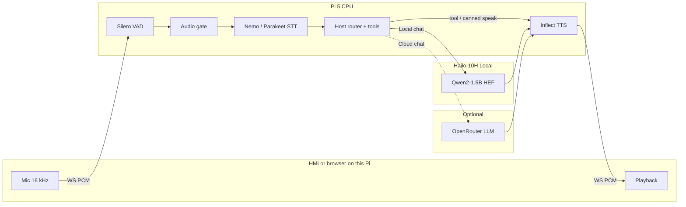

# Nova-Hailo — Raspberry Pi 5 + Hailo-10H voice cascade

On-device voice stack. STT, tools, and TTS run **on the Pi**. Chat LLM is
**Hailo-10H Qwen2 HEF** by default, or optional **OpenRouter** (Cloud) from
the HMI. A client (Qt HMI or browser) only streams mic PCM in and TTS PCM out.



| | |
| --- | --- |
| Share branch | `share/nova-hailo-poc-v002` |
| Repo | https://github.com/Senthi1Kumar/nova-s2s.git |
| App dir after clone | `nova-s2s/edge/nova-hailo` |
| HailoRT | **5.3.0** (AI HAT+ 2). HEF + C++ GenAI API follow `hailortcli fw-control identify` |
| Default profile | **tools enabled** (`config.oem_v002_test.yaml`) |
| LLM | **Local** Hailo Qwen2 HEF, or **Cloud** OpenRouter (`OPENROUTER_API_KEY`) |
| Search | **Exa only** (`EXA_API_KEY`). No Brave/Serper fallback |
| Python env | **`uv`** with system Python + `--system-site-packages` (see below) |
| HMI | PySide6 + QML (`hmi_qt/run.sh`). Live WS — not a mock / not C++ Qt |

This device is **self-contained** for Local mode. Cloud LLM is optional and
needs a network + OpenRouter key. No Tailscale / tunnel to another Pi.
Connect *this* Pi to the car (or HDMI + HAT audio) and run locally.

## Prerequisites

Install on the Pi before `setup_env.sh`. Missing keys do **not** block chat;
tools fail closed (`can't reach that service`). Never commit `.env`.

### Hardware / firmware

- Raspberry Pi 5 + Hailo-10H AI HAT+ 2
- HailoRT **5.3.0** (`hailortcli fw-control identify` → `Firmware Version: 5.3.0`)
- System package **`hailo_platform`** from `h10-hailort` / hailo-apps — **not pip**.
  Older 5.1.1 HEFs will not load on 5.3.0 firmware.

### `uv` (required)

Install [uv](https://docs.astral.sh/uv/) (`curl -LsSf https://astral.sh/uv/install.sh | sh`
or `pipx install uv`). We use **`uv venv`**, not `python -m venv`, and it **must**
be:

```bash
uv venv --python /usr/bin/python3 --system-site-packages .venv
```

`scripts/setup_env.sh` does that for you. Bare `uv venv` downloads uv’s own
CPython 3.12, which cannot see `hailo_platform` →
`No module named hailo_platform`. If you already made a bad venv:
`rm -rf .venv` then re-run `source scripts/setup_env.sh`.

### API keys (`.env`)

```bash
cp -n .env.example .env   # then edit — never commit .env
```

| Variable | Required for | If missing |
| --- | --- | --- |
| `EXA_API_KEY` | `web_search` (Exa only) | search fails closed |
| `TAVILY_API_KEY` | `deep_research` | research fails closed |
| `OPENROUTER_API_KEY` | HMI **Cloud** LLM | Local Hailo still works; Cloud switch errors |
| `OPENROUTER_MODEL` | optional Cloud default | `deepseek/deepseek-v4-flash-0731` |
| `GOOGLE_OAUTH_*` | calendar / gmail / drive | those tools fail closed until Settings → Connect |

`NOVA_HAILO_LLM_BACKEND=openrouter` boots Cloud without using the HMI switch.
Leave it unset for Local Hailo (the demo default).

## Clone and run (on the Pi)

```bash
git clone -b share/nova-hailo-poc-v002 https://github.com/Senthi1Kumar/nova-s2s.git
cd nova-s2s/edge/nova-hailo

cp -n .env.example .env          # fill keys from the table above
# export HAILO_APPS=/path/to/hailo-apps   # if hailo-apps is not on the default path

# If you already created .venv with uv's Python, wipe it first:
#   rm -rf .venv
source scripts/setup_env.sh      # uv venv + pip install -e .; first install is slow
/usr/bin/python3 -c "import hailo_platform; print(hailo_platform.__file__)"
# if that fails: dpkg -l | grep -i hailo   (install HailoRT python binding)
./scripts/fetch_models.sh        # STT/VAD/TTS + firmware-matched LLM HEF + hailo_llm_cpp.so
./scripts/preflight_oem.sh
./scripts/run_demo_oem.sh        # backend :8766 — Local Hailo unless Cloud is selected
```

Then either:

```bash
# Official driver UI (HDMI / car display). Audio = this Pi.
cd hmi_qt && ./run.sh
```

| Profile | Command | Tools |
| --- | --- | --- |
| **oem (default)** | `./scripts/run_demo_oem.sh` | web_search, deep_research, calendar, email, drive |
| conversation | `NOVA_HAILO_PROFILE=conversation ./scripts/run_demo_oem.sh` | gated off |
| rollback | `NOVA_HAILO_PROFILE=oem_rollback ./scripts/run_demo_oem.sh` | off, short chat |

Stack and model paths: [`docs/STACK.md`](docs/STACK.md). HMI: [`hmi_qt/README.md`](hmi_qt/README.md).

## Local vs Cloud LLM (OpenRouter)

Default is **Local**: Qwen2-1.5B HEF on Hailo-10H. Host still owns tools
(`ToolBroker`); the LLM is for chat. Hailo-10H holds **one** GenAI KV-cache —
switching Local HEFs evicts the previous model first.

**Cloud** is OpenRouter (`https://openrouter.ai/api/v1/chat/completions`).
STT / tools / TTS stay on the Pi. The cloud model may emit tool calls; the
Pi executes them (not raw MCP URLs). Regex host-router is skipped on Cloud
only. Switching to Cloud **releases** the Hailo LLM so the NPU is free.

From the HMI (after `hmi_qt/run.sh`): top bar **Local / Cloud**, or ⚙ Settings
→ model list. Needs `OPENROUTER_API_KEY` in `.env` (restart the backend after
editing `.env`).

| Cloud model (Settings) | OpenRouter id |
| --- | --- |
| DeepSeek V4 Flash (default) | `deepseek/deepseek-v4-flash-0731` |
| DeepSeek V3.2 | `deepseek/deepseek-v3.2` |
| Qwen3.8 Flash | `qwen/qwen3.8-flash` |
| GLM 4.7 Flash | `z-ai/glm-4.7-flash` |
| Inkling Small | `thinkingmachines/inkling-small` |

| Local HEF (Settings) | Alias |
| --- | --- |
| Qwen2 1.5B (default) | `qwen2` |
| Qwen2.5 1.5B / Qwen3 1.7B / Llama 3.2 1B / DeepSeek distill | zoo aliases in Settings |

Boot Cloud from env (no HMI):

```bash
# in .env
OPENROUTER_API_KEY=sk-or-...
# OPENROUTER_MODEL=deepseek/deepseek-v4-flash-0731
NOVA_HAILO_LLM_BACKEND=openrouter
```

Choice is also persisted in `runtime/hmi_settings.json` (gitignored).

## Stack (default oem)

| Stage | Backend | Device |
| --- | --- | --- |
| VAD | Silero ONNX | CPU |
| ASR | EN Nemo streaming GGUF (sidecar; endpointing off) | CPU |
| Host | Deterministic router + controller (fail-closed). Compact codec `t0`–`t6` is host-side only — Octopus Phase A, not a trained LoRA/HEF. | CPU |
| LLM | Qwen2-1.5B HEF (`llm_backend: cpp`; `.so` from `fetch_models.sh`). Optional OpenRouter | Hailo-10H or Cloud |
| Search | Exa only (`type=fast`, summary/highlights). Fail-closed if `EXA_API_KEY` missing | network |
| Research | Tavily async job | network |
| TTS | Inflect-Nano-v2 ONNX | CPU |

`tools.summarize_search` is **off**. Spoken news comes from Exa’s summary /
highlight, not a second Qwen pass. Numeric/stock still use the cleaner bypass.

ASR rollback: `model.stt_engine: parakeet`. TTS rollback: `model.tts_engine: piper`.
Local Hailo chat is **not** the tool picker (`tools.enable_in_prompt: false`).
Cloud OpenRouter may emit tool calls; the host still executes them.

### Engine keys

| Key | Default (tools profile) | Alternatives |
| --- | --- | --- |
| `model.stt_engine` | `nemo_speech` | `parakeet`, `whisper_hef` |
| `model.llm_hef` | `qwen2` | other HEF aliases |
| `model.llm_backend` | `cpp` (build on Pi) | `python`, `openrouter` (HMI Local/Cloud) |
| `model.tts_engine` | `inflect` | `piper`, `kokoro` |
| `tools.profile` | `oem_readonly` | `conversation`, `off` |
| `tools.summarize_search` | `false` | `true` re-enables Qwen rephrase |
| `tools.enabled` | search + research + Workspace | list in YAML |

## Dependencies

Runtime deps are in [`pyproject.toml`](pyproject.toml). Live search is **Exa
REST** via `httpx` (`EXA_API_KEY`). Brave/Serper are not used. The optional
`exa-py` package is **only** for `scripts/bench_websearch_providers.py`
(`uv sync --extra bench-search`), not the live pipeline.

`hailo_platform` / GenAI come from system packages, not PyPI. The native LLM
wrapper is compiled on the Pi by `fetch_models.sh` (HailoRT CMake + pybind11).

HMI: PySide6 + QML is in the same `pyproject.toml` as the backend.
`source scripts/setup_env.sh` installs everything; `hmi_qt/run.sh` uses that
venv. No C++ Qt / PyQt build. Empty transcript is **listening**, not a
wake-word mock.

## Models (`models/`)

Default STT is **Nemo-Speech**. One script downloads weights and builds
the C ABI library (no USB copy):

```bash
source scripts/setup_env.sh
./scripts/fetch_models.sh
```

That clones [NVIDIA/NeMo-Speech.cpp](https://github.com/NVIDIA/NeMo-Speech.cpp)
into `cloned/NeMo-Speech.cpp`, configures the `cpu-server` preset (CMake ≥ 3.26,
Ninja, g++), and installs `libnemo_speech_asr_c.so` into `models/nemo_speech/`.
It also clones [mudler/parakeet.cpp](https://github.com/mudler/parakeet.cpp)
into `cloned/parakeet.cpp` (pin `1bfbebf`, C API ABI ≥ 5), builds
`PARAKEET_SHARED=ON` (CLI/server/tests off), and installs `libparakeet.so`
plus ggml `.so` files next to `models/parakeet/tdt_ctc-110m-f16.gguf`
(rollback STT). Rebuild: `FORCE_PARAKEET_BUILD=1 ./scripts/fetch_models.sh`.
On a Pi with HailoRT it also runs `hailortcli fw-control identify`, downloads
`Qwen2-1.5B-Instruct.hef` from the matching Model Zoo tag (v5.3.0 / v5.2.0 /
v5.1.1), and compiles `nova_hailo/backends/hailo_llm_cpp*.so` against that
HailoRT. Needs `git`, `ninja`, `g++` (script will `apt` them if missing).
Rebuild NeMo: `FORCE_NEMO_BUILD=1 ./scripts/fetch_models.sh`. Rebuild LLM
wrapper only: `./scripts/build_hailo_llm_cpp.sh`.

| Role | Path | How |
| --- | --- | --- |
| STT GGUF | `models/nemo_speech/nemotron-speech-streaming-en-0.6b.q8_0.gguf` | HF nvidia/nemotron-speech-streaming-en-0.6b |
| STT lib | `models/nemo_speech/libnemo_speech_asr_c.so` | **built by `fetch_models.sh`** |
| STT rollback GGUF | `models/parakeet/tdt_ctc-110m-f16.gguf` | HF mudler/parakeet-cpp-gguf |
| STT rollback lib | `models/parakeet/libparakeet.so` | **built by `fetch_models.sh`** (parakeet.cpp)
| VAD | `models/silero_vad.onnx` | GitHub snakers4/silero-vad (not HF) |
| TTS | `models/Inflect-Nano-v2-ONNX/` | HF owensong/Inflect-Nano-v2-ONNX |
| TTS rollback | `models/piper/en_US-amy-low.onnx` | HF rhasspy/piper-voices |
| LLM HEF | `models/Qwen2-1.5B-Instruct.hef` | Hailo Model Zoo (`dev-public.hailo.ai/v5.3.0/blob/…` on 5.3 firmware) |
| LLM .so | `nova_hailo/backends/hailo_llm_cpp*.so` | **built by `fetch_models.sh`** (gitignored; HailoRT ABI) |

## Audio / display

- **HMI on this Pi** (`hmi_qt/run.sh`): HDMI + this Pi’s mic/speakers (WM8960 or USB). Speak — no wake word.
- **Browser on this Pi**: `http://localhost:8766/` (secure context for mic).
- `voice.barge_in_while_speaking: false` (WM8960 self-echo). Stop / Esc still works.
- One voice session at a time: close the other client first.

Laptop SSH is **optional** for development only (`ssh -L 8766:localhost:8766`,
then run `hmi_qt/run.sh` on the laptop so *laptop* audio is used). The car
demo does not need that.

## Google Workspace (one-time)

Settings → **Connect with Google** (callback port **8765**). Tokens: `runtime/google_oauth/tokens.json`.

## Fail-closed behavior

- Missing API keys / OAuth → honest “can’t reach…”; never invent tool success
- Empty STT after a committed turn → spoken “I didn’t catch that.”
- Empty Drive list-all uses a blank search needle (recent files), not the full ASR sentence
- Unmatched / thin turns do not loop forever on “say that again”

## Other entry points

```bash
./scripts/run_e2e_voice.sh      # CLI PTT voice
./scripts/run_web.sh            # web without oem launcher wrappers
./scripts/verify_oem_gates.sh   # offline gate harness
```

## HailoRT 5.3.0

Firmware, HEF, and the C++ GenAI wrapper must be the same line. A 5.1.1 HEF
on 5.3.0 firmware will fail to load.

```bash
hailortcli fw-control identify
# Firmware Version: 5.3.0 (release,app)
# Device Architecture: HAILO10H
```

`fetch_models.sh` maps that version to the Model Zoo blob (`v5.3.0` / `v5.2.0`
/ `v5.1.1`) and compiles `hailo_llm_cpp` against the installed HailoRT:

| HailoRT | C++ `LLM::generate` | Notes |
| --- | --- | --- |
| 5.1.1 | `(params, prompts)` | original PoC |
| 5.2+ | `(params, prompts, tools={})` | native tools exist; we pass `{}` |
| 5.3.0 | same as 5.2 + 10 min read timeout | **this drop** |

Host still owns tool routing (`tools.enable_in_prompt: false`). Do not switch
the demo to Hailo function-calling HEFs unless you opt in
(`HAILO_FETCH_FC_HEF=1`, alias `qwen2-fc`).

## Architecture notes

- Host owns tools: router → controller → `ToolBroker`. Local Hailo LLM is for
  chat (and jokes / second-miss), not schema tool-calling. Cloud OpenRouter may
  pick tools; the Pi still executes them.
- Compact codec (`t0(query="…")`) is a host wire format. Octopus Phase B (LoRA)
  and Phase C (new HEF tokens) are **not** in this drop.
- Native LLM context when `pipeline.native_context: true`.
- Nemo sidecar: server endpointing **must stay off**; Silero owns turn boundaries.
- Native C++ LLM backend releases the GIL during decode so TTS can overlap.
