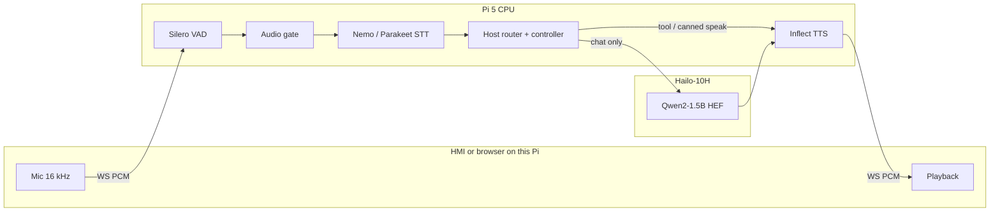

# Nova-Hailo — Raspberry Pi 5 + Hailo-10H voice cascade

On-device voice stack. All models and tools run **on the Pi + Hailo-10H**.
A client (Qt HMI or browser) only streams mic PCM in and TTS PCM out.



| | |
| --- | --- |
| Share branch | `share/nova-hailo-poc-v002` |
| Repo | https://github.com/Senthi1Kumar/nova-s2s.git |
| App dir after clone | `nova-s2s/edge/nova-hailo` |
| HailoRT | **5.1.1** (pin; do not upgrade lightly) |
| Default profile | **tools enabled** (`config.oem_v002_test.yaml`) |

This device is **self-contained**. No Tailscale / tunnel to another Pi.
Connect *this* Pi to the car (or HDMI + HAT audio) and run locally.

## Clone and run (on the Pi)

Needs the same hardware class: Pi 5 + Hailo-10H AI HAT+ 2, HailoRT 5.1.1,
hailo-apps / `hailo_platform`, Qwen2 HEF already installed.

```bash
git clone -b share/nova-hailo-poc-v002 https://github.com/Senthi1Kumar/nova-s2s.git
cd nova-s2s/edge/nova-hailo

cp -n .env.example .env          # fill API keys — never commit .env
# export HAILO_APPS=/path/to/hailo-apps   # if hailo-apps is not on the default path

source scripts/setup_env.sh      # one venv: backend + HMI (PySide6, numpy, …)
./scripts/fetch_models.sh        # STT/VAD/TTS weights + build NeMo-Speech .so

./scripts/build_hailo_llm_cpp.sh # hailo_llm_cpp*.so on THIS Pi
./scripts/preflight_oem.sh
./scripts/run_demo_oem.sh        # backend :8766 — all AI on this HAT
```

Then either:

```bash
# Official driver UI (HDMI / car display). Audio = this Pi.
cd hmi_qt && ./run.sh
```

| Profile | Command | Tools |
| --- | --- | --- |
| **oem (default)** | `./scripts/run_demo_oem.sh` | web_search, deep_research, calendar, email, drive |
| conversation | `NOVA_HAILO_PROFILE=conversation ./scripts/run_demo_oem.sh` | gated off |
| rollback | `NOVA_HAILO_PROFILE=oem_rollback ./scripts/run_demo_oem.sh` | off, short chat |

Stack and model paths: [`docs/STACK.md`](docs/STACK.md). HMI: [`hmi_qt/README.md`](hmi_qt/README.md).

## Stack (default oem)

| Stage | Backend | Device |
| --- | --- | --- |
| VAD | Silero ONNX | CPU |
| ASR | EN Nemo streaming GGUF (sidecar; endpointing off) | CPU |
| Host | Deterministic router + controller (fail-closed). Compact codec `t0`–`t6` is host-side only — Octopus Phase A, not a trained LoRA/HEF. | CPU |
| LLM | Qwen2-1.5B HEF (`llm_backend: cpp` after on-device build) | Hailo-10H |
| Search | Exa (`type=fast`, summary/highlights) → Brave → Serper | network |
| Research | Tavily async job | network |
| TTS | Inflect-Nano-v2 ONNX | CPU |

`tools.summarize_search` is **off**. Spoken news comes from Exa’s summary /
highlight, not a second Qwen pass. Numeric/stock still use the cleaner bypass.

ASR rollback: `model.stt_engine: parakeet`. TTS rollback: `model.tts_engine: piper`.
Chat LLM is **not** the tool picker (`tools.enable_in_prompt: false`).

### Engine keys

| Key | Default (tools profile) | Alternatives |
| --- | --- | --- |
| `model.stt_engine` | `nemo_speech` | `parakeet`, `whisper_hef` |
| `model.llm_hef` | `qwen2` | other HEF aliases |
| `model.llm_backend` | `cpp` (build on Pi) | `python` |
| `model.tts_engine` | `inflect` | `piper`, `kokoro` |
| `tools.profile` | `oem_readonly` | `conversation`, `off` |
| `tools.summarize_search` | `false` | `true` re-enables Qwen rephrase |
| `tools.enabled` | search + research + Workspace | list in YAML |

## Dependencies

Runtime deps are in [`pyproject.toml`](pyproject.toml). Live search uses **`httpx`** against Exa/Brave/Serper REST APIs (`EXA_API_KEY` primary). The optional `exa-py` package is **only** for `scripts/bench_websearch_providers.py` (`uv sync --extra bench-search`), not the live pipeline.

`hailo_platform` / GenAI come from system packages, not PyPI. The native LLM
wrapper needs HailoRT CMake + pybind11 (`scripts/build_hailo_llm_cpp.sh`).

HMI: PySide6 is in the same `pyproject.toml` as the backend. `source scripts/setup_env.sh` installs everything; `hmi_qt/run.sh` uses that venv. No C++ Qt build.

## Models (`models/` — not in git)

Default STT is **Nemo-Speech**. One script downloads weights **and** builds
the C ABI library (no USB copy):

```bash
source scripts/setup_env.sh
./scripts/fetch_models.sh
```

That clones [NVIDIA/NeMo-Speech.cpp](https://github.com/NVIDIA/NeMo-Speech.cpp)
into `cloned/NeMo-Speech.cpp`, configures the `cpu-server` preset (CMake ≥ 3.26,
Ninja, g++), and installs `libnemo_speech_asr_c.so` into `models/nemo_speech/`.
Needs `git`, `ninja`, `g++` (script will `apt` them if missing). Rebuild:
`FORCE_NEMO_BUILD=1 ./scripts/fetch_models.sh`.

| Role | Path | How |
| --- | --- | --- |
| STT GGUF | `models/nemo_speech/nemotron-speech-streaming-en-0.6b.q8_0.gguf` | HF nvidia/nemotron-speech-streaming-en-0.6b |
| STT lib | `models/nemo_speech/libnemo_speech_asr_c.so` | **built by `fetch_models.sh`** |
| VAD | `models/silero_vad.onnx` | HF snakers4/silero-vad |
| TTS | `models/Inflect-Nano-v2-ONNX/` | HF owensong/Inflect-Nano-v2-ONNX |
| TTS rollback | `models/piper/en_US-amy-low.onnx` | HF rhasspy/piper-voices |
| LLM | Hailo `qwen2` HEF | hailo-apps (not this script) |

## Audio / display

- **HMI on this Pi** (`hmi_qt/run.sh`): HDMI + this Pi’s mic/speakers (WM8960 or USB).
- **Browser on this Pi**: `http://localhost:8766/` (secure context for mic).
- `voice.barge_in_while_speaking: false` (WM8960 self-echo). Stop / Esc still works.
- One voice session at a time: close the other client first.

Laptop SSH is **optional** for development only (`ssh -L 8766:localhost:8766`,
then run `hmi_qt/run.sh` on the laptop so *laptop* audio is used). The car
demo does not need that.

## Google Workspace (one-time)

Settings → **Connect with Google** (callback port **8765**). Tokens: `runtime/google_oauth/tokens.json`.

## Fail-closed behavior

- Missing API keys / OAuth → honest “can’t reach…”; never invent tool success
- Empty STT after a committed turn → spoken “I didn’t catch that.”
- Empty Drive list-all uses a blank search needle (recent files), not the full ASR sentence
- Unmatched / thin turns do not loop forever on “say that again”

## Other entry points

```bash
./scripts/run_e2e_voice.sh      # CLI PTT voice
./scripts/run_web.sh            # web without oem launcher wrappers
./scripts/verify_oem_gates.sh   # offline gate harness
```

## Architecture notes

- Host owns tools: router → controller → `ToolBroker`. LLM is for chat (and
  jokes / second-miss), not schema tool-calling.
- Compact codec (`t0(query="…")`) is a host wire format. Octopus Phase B (LoRA)
  and Phase C (new HEF tokens) are **not** in this drop.
- Native LLM context when `pipeline.native_context: true`.
- Nemo sidecar: server endpointing **must stay off**; Silero owns turn boundaries.
- Native C++ LLM backend releases the GIL during decode so TTS can overlap.
