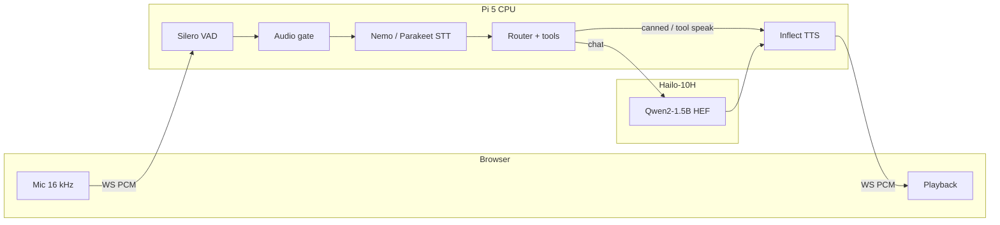

# Nova-Hailo — Raspberry Pi 5 + Hailo-10H voice cascade

On-device voice stack: browser mic → WebSocket → VAD/gate → ASR → deterministic router/tools → Hailo LLM → TTS → browser playback.



| | |
| --- | --- |
| Dev tree | `edge/nova-hailo` |
| Device path | `~/nsk/nova-hailo` |
| HailoRT | **5.1.1** (pin; do not upgrade lightly) |
| Default profile | **tools enabled** (`config.oem_v002_test.yaml`) |

## Default launch (tools ON)

Web search (Exa→Brave→Serper), deep research (Tavily), and Workspace read-only (calendar / email / drive) are **enabled** on the default profile.

```bash
cd ~/nsk/nova-hailo
cp -n .env.example .env   # EXA_API_KEY, BRAVE_/SERPER_, TAVILY_, GOOGLE_OAUTH_*
source scripts/setup_env.sh
./scripts/preflight_oem.sh
./scripts/run_demo_oem.sh
# UI: http://localhost:8766/   (secure context for mic; tunnel from laptop if needed)
```

| Profile | Command | Tools |
| --- | --- | --- |
| **oem (default)** | `./scripts/run_demo_oem.sh` | web_search, deep_research, calendar, email, drive |
| conversation | `NOVA_HAILO_PROFILE=conversation ./scripts/run_demo_oem.sh` | gated off |
| rollback | `NOVA_HAILO_PROFILE=oem_rollback ./scripts/run_demo_oem.sh` | off, short chat |

Stack, profiles, and models: [`docs/STACK.md`](docs/STACK.md).

## Stack (default oem)

| Stage | Backend | Device |
| --- | --- | --- |
| VAD | Silero ONNX | CPU |
| ASR | EN Nemo streaming GGUF (sidecar; endpointing off) | CPU |
| Router / tools | Deterministic allowlist → broker (fail-closed) | CPU |
| LLM | Qwen2-1.5B HEF (`llm_backend: cpp`) | Hailo-10H |
| Search | Exa REST → Brave → Serper (`httpx`) | network |
| TTS | Inflect-Nano-v2 ONNX → browser | CPU |

ASR rollback: set `model.stt_engine: parakeet` in the active config. TTS rollback: `model.tts_engine: piper`.

### Engine keys

| Key | Default (tools profile) | Alternatives |
| --- | --- | --- |
| `model.stt_engine` | `nemo_speech` | `parakeet`, `whisper_hef` |
| `model.llm_hef` | `qwen2` | other HEF aliases |
| `model.tts_engine` | `inflect` | `piper`, `kokoro` |
| `tools.profile` | `oem_readonly` | `conversation`, `off` |
| `tools.enabled` | search + research + Workspace | list in YAML |

## Dependencies

Runtime deps are in [`pyproject.toml`](pyproject.toml). Live search uses **`httpx`** against Exa/Brave/Serper REST APIs (`EXA_API_KEY` primary). The optional `exa-py` package is **only** for `scripts/bench_websearch_providers.py` (`uv sync --extra bench-search`), not the live pipeline.

`hailo_platform` / GenAI come from system packages, not PyPI.

## Mic / playback

Use `voice.playback: browser` so Chromium can cancel its own output. Prefer `localhost` or SSH tunnel for mic secure-context. `voice.barge_in_while_speaking: false` by default (stop button interrupts).

```bash
ssh -L 8766:localhost:8766 <user>@<pi-host>
```

## Sync laptop → device

Edit on the laptop, rsync to the Pi (do not rsync `.env`, `models/`, `cloned/`, `logs/`).

```bash
rsync -avz \
  --exclude '.venv/' --exclude '__pycache__/' --exclude 'logs/' \
  --exclude 'models/' --exclude 'cloned/' --exclude 'hailo-docs/' \
  --exclude '.env' \
  -e "ssh -i <key>" \
  edge/nova-hailo/ <user>@<pi>:~/nsk/nova-hailo/
```

Keep HEFs, Nemo/parakeet GGUFs, Inflect weights, and `.venv` on the device. Workspace MCP adapters need the `nova` package path on `PYTHONPATH` for calendar/email/drive.

## Google Workspace (one-time)

Settings → **Connect with Google** (callback port **8765**). Tokens: `runtime/google_oauth/tokens.json`.

## Fail-closed behavior

- Missing API keys / OAuth → honest “can’t reach…”; never invent tool success  
- Empty STT after a committed turn → spoken “I didn’t catch that.”  
- Empty Drive list-all uses a blank search needle (recent files), not the full ASR sentence  

## Other entry points

```bash
./scripts/run_e2e_voice.sh      # CLI PTT voice
./scripts/run_web.sh            # web without oem launcher wrappers
./scripts/verify_oem_gates.sh   # offline gate harness
```

## Architecture notes

- GenAI: `hailo_platform.genai` (`LLM`, optional STT HEF).  
- Native LLM context on device when `pipeline.native_context: true`.  
- Tool path: router → `ToolBroker` only (no second invoker).  
- Nemo sidecar: server endpointing **must stay off**; Silero owns turn boundaries.  
